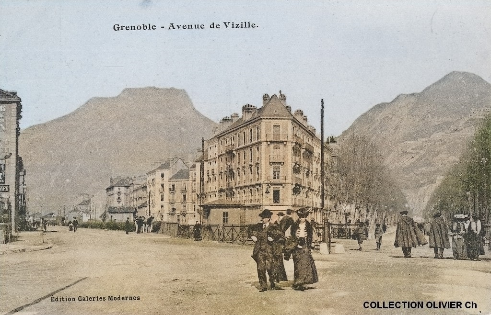

# Grenoble avant/après

A press-and-hold photo comparison gallery showing Grenoble then and now.

Live at **[grenoble.donias.fr](https://grenoble.donias.fr)**



## How it works

Each card shows a historical photo of a Grenoble location. Press and hold (or hold Space/Enter when focused) to reveal the same spot today.

## Adding photos

Drop image pairs into the `img/` folder following this naming convention:

- `yourname.jpg` — the "then" photo
- `yourname_now.jpg` — the "now" photo

The server and build script pick up all pairs automatically.

## Running locally

```bash
npm install
npm start
```

Then open [http://localhost:8080](http://localhost:8080).

## Building for static hosting

```bash
npm run build
```

This compiles the Handlebars template into `dist/index.html` and copies images into `dist/img/`. The `dist/` folder can then be deployed to any static host.
